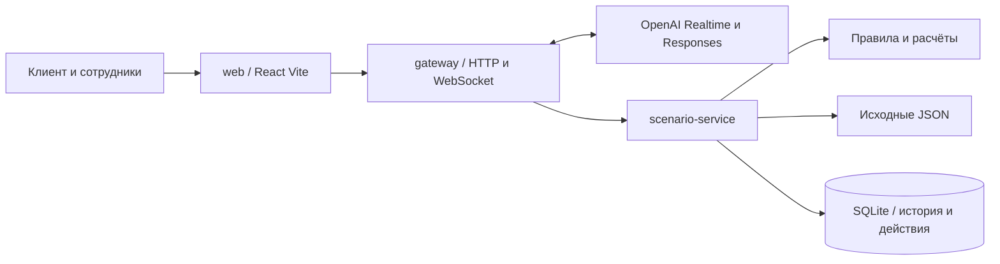

# Saqta Voice Router

Проект команды QosQanat для HackAlem.

Голосовой симулятор страхового контакт-центра. Он выбирает сценарий обращения, отвечает по учебным данным Saqta и передаёт незавершённый разговор оператору вместе с историей. Покупки, выплаты, отправка документов и запись на приём выполняются только в демонстрационной базе.

## Запуск

Нужны Docker с Compose и ключ OpenAI с доступом к Realtime. Скопируйте `.env.example` в `.env`, заполните `OPENAI_API_KEY`, `INTERNAL_SECRET` (случайная строка от 24 символов) и `STAFF_PASSWORD` (от 12 символов). Ключ остаётся на сервере.

```bash
docker compose up --build
```

Откройте http://localhost:3000. Compose ждёт готовности сервисов и сохраняет историю в volume `history`. При повторном запуске обращения остаются в базе. Команда `docker compose down -v` удаляет этот volume, поэтому для обычной остановки используйте `docker compose down`.

Служебные секреты можно сгенерировать командой `pnpm env:setup`: она дополняет `.env`, сохраняя уже заданный ключ.

Для разработки нужны Node 22.13 или новее и pnpm 10.8.0.

```bash
pnpm install --frozen-lockfile
pnpm dev
```

`pnpm dev` запускает все три приложения. Если служебные секреты не заданы, команда создаёт их в локальном `var/local-config.json`. Пароль сотрудников находится в поле `STAFF_PASSWORD`. Этот файл, база и `.env` исключены из Git и графа проекта. Для голоса нужен localhost или HTTPS и разрешение браузера на микрофон.

Отдельные сервисы запускаются командами `pnpm dev:web`, `pnpm dev:gateway`, `pnpm dev:scenario`. При отдельном запуске задайте служебные секреты в `.env`. После изменения настроек перезапустите процессы.

## Пользователи и языки

| Роль | Что доступно |
| --- | --- |
| Клиент | Голос, текст, подтверждение изменения, продолжение обращения, запрос оператора |
| Оператор | Очередь, история, следующий шаг, результаты действий, принятие обращения и передача коллеге |
| Супервизор | Просмотр обращений, переназначение и закрытие |
| Технический администратор | Настройки через окружение, запуск, проверка данных и локальный сброс |

Рабочее место находится на `/staff`. Учётные записи `operator1`, `operator2`, `supervisor` используют демонстрационный пароль из настроек. Сервер проверяет роль и владельца обращения при каждом действии. Администратор управляет сервисами с машины разработчика; отдельной панели администратора в MVP нет.

Интерфейс доступен на русском, казахском и английском. Выбор сохраняется в браузере; смена языка не закрывает разговор и не переводит сохранённые реплики. Голос работает с русским, казахским и смешанной речью. Английский голос не входит в объём MVP.

## Телефон, история и приветствие

Перед разговором клиент вводит телефон. Допустимы номера, начинающиеся с «плюс семь», семёрки или восьмёрки, с пробелами, скобками и дефисами. Сервер приводит их к единому международному формату и в одной транзакции находит или создаёт клиента. Разговор хранится по постоянному идентификатору клиента.

После ввода номера интерфейс показывает прошлые обращения. Можно посмотреть историю, продолжить незавершённое обращение или начать новое. Последнее обращение автоматически не открывается. До выбора голосовой и текстовый ввод недоступны. Новый звонок и восстановление после обрыва начинаются с сохранённого приветствия; обычное обновление действующей страницы не добавляет его повторно. При включении голоса приветствие озвучивается, а микрофон уже принимает речь: помощника можно перебить.

Сервис выбирает язык приветствия по предыдущему общению. Если истории нет, используется язык интерфейса; для английского интерфейса приветствие будет на русском. Далее учитываются три последние содержательные реплики клиента. При равенстве выбирается язык последней реплики. Числа и короткие подтверждения язык не меняют. Прямая просьба сменить язык действует до следующей такой просьбы и сохраняется для нового звонка.

Произнесённый чужой телефон, ИИН или номер полиса не меняет владельца разговора. Смена контактного телефона требует отдельного подтверждения и сохраняет историю у прежнего клиента. Список обращений и выбранная история доступны только по токену сессии того же клиента и окружения. Старые анонимные обращения автоматически к номеру не присоединяются.

Ввод телефона без проверки по SMS допустим только в этой синтетической демонстрации. Пользователь, знающий демонстрационный номер, может начать новую сессию этого клиента.

## Архитектура



`apps/web` показывает разговор и рабочее место. `apps/gateway` проверяет доступ, управляет соединениями и вызывает модели. `apps/scenario-service` владеет бизнес-состоянием и единолично пишет в SQLite. Внутренний API защищён сервисным секретом; Compose не публикует его порт.

Общие пакеты содержат контракты (`contracts`), правила (`core`), провайдер модели (`ai`), хранение (`db`), знания (`knowledge`) и переводы (`i18n`). Всё написано на TypeScript strict с ESM. SQLite создаёт схему версии 2 при старте, включает WAL и восстанавливает состояние оборванных сессий. Обновление до версии 2 добавляет уникальный индекс телефонов в пределах демонстрационного окружения; существующие обращения сохраняются.

Основная модель `gpt-realtime-2.1`, резервная `gpt-realtime`. Маршрутизатор получает весь каталог и возвращает вызов `route_turn`; сервер проверяет его структуру и допустимые значения. Короткий ответ по результатам правил готовит `gpt-4.1-mini`, затем Realtime озвучивает одобренный текст. Такой дополнительный шаг упрощает контроль фактов, но увеличивает задержку. Провайдер маршрутизации отделён интерфейсом `RoutingProvider`; NVIDIA можно подключить отдельным адаптером. В MVP второй провайдер не реализован.

Нажмите «Включить голос» один раз. Микрофон передаёт звук через AudioWorklet; после 700 мс тишины реплика завершается автоматически. Сохраняются 300 мс звука до начала речи. Отдельное постоянное соединение с `gpt-live-transcribe` показывает промежуточный текст во время речи. Модель задаётся через `TRANSCRIPTION_MODEL`.

Черновик распознавания виден в переписке, но в историю и бизнес-правила попадает только окончательный текст. Ответ генерируется потоком: законченные предложения проходят маскирование персональных данных, появляются в переписке и последовательно озвучиваются через Realtime. Воспроизведение начинается с первого звукового фрагмента. При включённом голосе озвучиваются и ответы на напечатанные сообщения.

Помощника можно перебить: воспроизведение останавливается, оставшийся ответ отменяется, микрофон принимает новую реплику. Прерванный ответ остаётся в истории с отметкой о неполной доставке. Если помощник не успел полностью озвучить предложение выполнить операцию, перед подтверждением его нужно повторить; выполненная операция при перебивании не отменяется и не повторяется. При передаче оператору автоматические ответы прекращаются.

Кнопка микрофона позволяет временно отключить запись. «Выключить голос» возвращает обычный текстовый режим. При недоступности живого распознавания интерфейс предлагает текст и ручной голосовой режим с кнопкой завершения реплики. Это резервный режим, он не считается проверкой живого распознавания.

Аудио PCM 24 кГц передаётся по WebSocket `/api/live` и по умолчанию не сохраняется. После обрыва старая очередь звука не воспроизводится. Это веб-симулятор, без телефонной сети и автоматического обзвона.

## Знания и действия

Каталог загружается из неизменённых `docs/voice_router_dataset`: 40 бизнес-сценариев, 3 системных исхода, 43 поля и 31 действие. Факты берутся из `knowledge_base.json`, клиентские данные из `mock_backend.json`. Поиск выбирает разделы по сценарию и возвращает ссылку на файл и JSON-путь. Отдельная векторная база для этого небольшого набора не нужна.

Стоимость и возврат считает код. Если тарифа нет в исходных данных, система передаёт вопрос оператору. Запись на приём использует явно обозначенное демонстрационное расписание. Недостаток данных нельзя заменять выдуманной ценой или подтверждением покрытия.

Для девяти необратимых действий сервер сначала сохраняет предложение с конкретными параметрами. Перед выполнением пользователь должен отдельно подтвердить все параметры действия. Изменение параметров, обрыв связи или возобновление обращения отменяет старое предложение. Перед выполнением сервер заново проверяет данные и сравнивает расчёт с показанным предложением. Повтор запроса с тем же идентификатором не повторяет действие.

## Память, обрыв и передача

Клиент, обращение и сессия связи хранятся отдельно. После обработки каждой реплики сохраняются её текст, сценарии, поля, отложенные темы, следующий шаг и журнал действий. Краткая сводка дополняет исходную историю.

После поиска клиента новое обращение получает доступ только к его прошлым обсуждениям в текущем демонстрационном окружении. Незавершённые обращения можно продолжить. Закрытие вкладки не означает, что вопрос решён. Сервис отслеживает активность: проверка связи каждые 10 секунд для голосового соединения, потеря связи после 30 секунд без ответа. Клиентский текстовый интерфейс обновляет активность каждые 5 секунд.

Оператор принимает обращение. Второй сотрудник не может одновременно стать владельцем. Передача сохраняет историю; прежний оператор теряет право отвечать. После назначения человека AI перестаёт отвечать и выполнять действия. В карточке видны следующий шаг, причины отключения, предложения и результаты действий. Выполнение операции и доставка сообщения клиенту учитываются отдельно.

## Защита и границы

Сервер ограничивает размер сообщений, проверяет поля, Origin, принадлежность полиса и обращения. Служебная сессия хранится в HttpOnly cookie. Роли и поле `confirmed`, переданные клиентом, не дают полномочий. Реплики отображаются как текст без исполнения HTML. История и сводки передаются модели как недоверенные данные; они не меняют каталог инструментов и правила выполнения.

Разные обращения обрабатываются параллельно, запросы одной сессии выполняются последовательно. Записи и действия проходят в коротких транзакциях; ожидание модели не удерживает блокировку SQLite. Число одновременных обращений к модели ограничено. Настоящая проверка личности по телефону здесь отсутствует: поиск клиента допустим только для предоставленных синтетических данных.

Это MVP для одной копии каждого сервиса. Для промышленной эксплуатации нужны полноценная аутентификация, защищённая идентификация клиента, политика хранения, отдельные аккаунты сотрудников и распределённая очередь.

## Проверки

```bash
pnpm typecheck
pnpm test
pnpm build
pnpm eval
pnpm eval dialogs
node --import tsx evals/src/voice.ts
node --import tsx evals/src/phone-http.ts
node --import tsx evals/src/live-transcription.ts
node --import tsx evals/src/live-voice.ts
node --import tsx evals/src/live-interruption.ts
```

Команды `eval`, `eval dialogs` и все голосовые прогоны используют платный OpenAI API. Проверка `phone-http` работает через запущенные сервисы без вызовов модели. `pnpm eval` проверяет 104 реплики тем же маршрутизатором, что приложение. Диалоги проходят через маршрутизатор, правила, SQLite и генерацию ответов. Отчёты сохраняются локально в `evals/artifacts`. Проверка голоса синтезирует тестовые фразы на трёх вариантах речи и передаёт звук через настоящий gateway; она не заменяет проверку человеком с микрофоном.

Тесты без API проверяют изоляцию истории, подтверждения, повтор запросов, отмену при обрыве, смену оператора и перезапуск базы. Измерения и оставшиеся ограничения описаны в `docs/validation.md`.

Для сброса локальной демонстрации остановите сервисы и выполните `pnpm demo:reset`. Команда архивирует локальную базу; при следующем запуске создаются исходные данные. Volume Docker эта команда не меняет.

## Демонстрация и условия задания

Введите синтетический номер из `mock_backend.json`. Начните с вопроса об офисе на русском, затем повторите на казахском. Покажите сценарий и источник в панели решения. После этого измените контакт синтетического клиента: сначала предложение, затем отдельное подтверждение. Прервите разговор, найдите обращение на рабочем месте и передайте его второму оператору. Покажите сохранившуюся историю и отсутствие повторного действия.

Рубрика задания отдельно оценивает функциональность, техническое решение и README по 25 баллов, ценность на 15 и оригинальность на 10. Поэтому в MVP приоритет получили проверяемые сценарии, безопасные действия, передача контекста и воспроизводимый запуск. Связь этой рубрики с отдельными 30 баллами голосовой оценки и 2 бонусными баллами в материалах не определена.

В примерах есть вопросы сразу о нескольких полях, хотя требования просят один вопрос за раз. Реализация следует ограничению одного вопроса. В каталоге действий местами не хватает параметров; сервер дополняет проверки по схемам полей и знаниям. Тариф КАСКО для части возрастов и реальное расписание клиник отсутствуют. Эти пробелы не заполняются догадками. Подробнее см. `docs/task-audit.md`.

Graphify 0.9.65 и humanizer-ru используются при разработке и не нужны для запуска приложения. Граф обновляется через `pnpm graph:update`; правила запросов `query`, `path`, `explain` закреплены в `AGENTS.md`. Ревизии инструментов указаны в `docs/tool-versions.json`.
