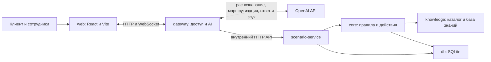

# Saqta Voice Router

Проект команды QosQanat для HackAlem. Голосовой симулятор страхового контакт-центра с AI-маршрутизацией обращений.

Клиент описывает вопрос своими словами на русском, казахском или смешанном языке. Помощник выбирает сценарий, уточняет недостающие данные и отвечает по учебной базе Saqta. Если нужен сотрудник, он получает обращение вместе с историей и следующим шагом.

Проект решает задачу первичного обслуживания клиентов страховой компании: разобраться в запросе, собрать данные и сохранить контекст при передаче оператору. Клиенту доступен разговор в браузере, оператору и супервизору - рабочее место для обработки обращений.

**Это демонстрационный прототип.** Клиенты, полисы и тарифы синтетические. Покупка полиса, запись на приём и отправка документов изменяют только демонстрационное состояние; реальных страховых операций приложение не выполняет.

## Что реализовано

- Голосовой и текстовый диалог. В голосовом режиме доступны промежуточная расшифровка, автоматический ответ после паузы, озвучивание и перебивание помощника. Есть отключение микрофона и резервный режим с ручным завершением реплики.
- Выбор сценария языковой моделью из каталога: 40 бизнес-сценариев и 3 системных исхода. Каталог охватывает страховые продукты, страховые случаи, ДМС, обслуживание полисов, платежи, офисы, жалобы и запрос оператора.
- Сбор и проверка полей, уточняющие вопросы, обработка нескольких тем с сохранением отложенных запросов.
- Ответы по базе знаний с указанием файла и раздела источника. Панель решения показывает выбранные сценарии, извлечённые данные и ход обработки.
- Расчёт стоимости и возврата по правилам в коде. В каталоге есть 31 действие; для 9 действий с признаком необратимости предусмотрено отдельное подтверждение параметров.
- Привязка демонстрационного клиента к телефону, просмотр прошлых обращений, начало нового и продолжение незавершённого разговора.
- Сохранение истории, состояния сценария и журнала операций в SQLite. Повтор запроса с тем же идентификатором не выполняет действие повторно.
- Рабочее место оператора: очередь, принятие обращения, переписка и передача коллеге. Супервизор может переназначать и закрывать обращения. После передачи человеку AI прекращает ответы и действия.
- Интерфейс на русском, казахском и английском. Его язык выбирается отдельно от языка разговора; сохранённые сообщения не переводятся при переключении.

## Как работает решение

1. Клиент вводит телефон. Сервер нормализует номер и находит либо создаёт демонстрационного клиента.
2. На экране истории клиент начинает новое обращение или продолжает незавершённое. До выбора ввод сообщения недоступен.
3. Клиент говорит в микрофон или печатает запрос. Голос поступает на сервер по WebSocket и преобразуется в текст через OpenAI.
4. AI-маршрутизатор возвращает структурированный вызов `route_turn`: сценарии и извлечённые поля. Сервер проверяет ответ модели по схемам и правилам каталога.
5. Сервис сценариев выбирает факты из JSON, запрашивает недостающие данные или выполняет расчёт. Для операции с обязательным подтверждением сначала сохраняет предложение с конкретными параметрами.
6. После отдельного подтверждения сервер повторно проверяет параметры и выполняет действие. Изменение данных или обрыв связи отменяет прежнее предложение.
7. Клиент получает текстовый ответ и, при включённом голосе, звук. История и результат сохраняются. При передаче оператору тот продолжает работу с этим же обращением.

## Технологии

| Область | Используется в репозитории |
| --- | --- |
| Язык и среда | TypeScript 5.8, strict, ESM; Node.js от 22.13 |
| Организация проекта | pnpm 10.8.0, workspace-монорепозиторий |
| Интерфейс | React 19, Vite 6, CSS, иконки Lucide React |
| HTTP и соединения | Express 4, библиотека `ws`, WebSocket |
| Проверка данных | Zod 3 |
| Хранение | SQLite через встроенный `node:sqlite`, режим WAL |
| Звук в браузере | Web Audio API, AudioWorklet, PCM 24 кГц; детектор речи и пауз |
| AI и внешние API | OpenAI Realtime API и Responses API |
| Настройки и запуск | dotenv, Docker, Docker Compose |
| Проверки | TypeScript, встроенный `node:test`, tsx; собственные сценарии в `evals` |

Имена моделей по умолчанию заданы в [`.env.example`](.env.example). Их доступность зависит от OpenAI-аккаунта и проверяется при реальном вызове API.

| Переменная | Значение | Назначение |
| --- | --- | --- |
| `REALTIME_MODEL` | `gpt-realtime-2.1` | Маршрутизация и работа Realtime |
| `REALTIME_FALLBACK_MODEL` | `gpt-realtime` | Резервная модель маршрутизатора |
| `TEXT_MODEL` | `gpt-4.1-mini` | Формирование ответа по результатам обработки |
| `TRANSCRIPTION_MODEL` | `gpt-live-transcribe` | Потоковое распознавание речи |

В голосовых тестах дополнительно используется OpenAI Audio API с моделью `gpt-4o-mini-tts` для синтеза входных фраз.

Модель подключена через интерфейс `RoutingProvider`. Реализован провайдер OpenAI; адаптера NVIDIA в текущей версии нет. Graphify и humanizer-ru используются при разработке и не нужны для запуска приложения.

## Архитектура проекта



| Каталог | Ответственность |
| --- | --- |
| `apps/web` | Клиентский экран, история, голос и рабочее место сотрудников |
| `apps/gateway` | Публичный HTTP API, WebSocket, проверка доступа, вызовы AI |
| `apps/scenario-service` | Состояние обращения, внутренний API, запуск бизнес-правил |
| `packages/core` | Диалоговый движок, расчёты, подтверждения, выполнение действий |
| `packages/db` | Схема SQLite, клиенты, обращения, сообщения и журнал операций |
| `packages/ai` | OpenAI, распознавание, маршрутизация и потоковые ответы |
| `packages/knowledge` | Загрузка каталога и выбор фактов по сценарию |
| `packages/contracts` | Общие типы и схемы проверки данных |
| `packages/i18n` | Переводы интерфейса |
| `docs/voice_router_dataset` | Исходные учебные данные и примеры |
| `evals` | Проверки маршрутизации, диалогов, HTTP и голоса |
| `scripts` | Запуск, настройка окружения, сброс демонстрации и граф проекта |

Бизнес-состояние меняют сервис сценариев и его движок через пакет `db`. Модель не получает прямого доступа к SQLite. Внутренний API защищён `INTERNAL_SECRET`; Compose не публикует порт сервиса сценариев.

Телефон клиента, обращение и сессия соединения учитываются отдельно. При перезапуске сервер восстанавливает состояние оборванных сессий. Запросы одной сессии обрабатываются последовательно; число одновременных обращений к модели ограничивается настройкой `MAX_ACTIVE_MODELS`.

## Установка и запуск

Все команды ниже выполняются из корня репозитория, где находятся `package.json` и `compose.yaml`. Если открыт родительский каталог `HackAlem`, сначала выполните:

```bash
cd hack-7b90b090-qosqanat
```

Для диалога нужен интернет и ключ OpenAI с доступом к настроенным моделям, включая Realtime. Это относится и к текстовому режиму. Вызовы API платные. Для микрофона нужен браузер с доступом к Web Audio и разрешением на запись; открывайте приложение через localhost или HTTPS.

### Локально через Node.js

1. Установите Node.js версии 22.13 или новее и pnpm 10.8.0. Если используете Corepack:

   ```bash
   corepack enable
   corepack prepare pnpm@10.8.0 --activate
   ```

2. Установите зависимости:

   ```bash
   pnpm install --frozen-lockfile
   ```

3. При первом запуске создайте файл настроек. Если `.env` уже существует, сохраните его и измените нужные значения вручную.

   ```bash
   cp .env.example .env
   pnpm env:setup
   ```

   Команда `env:setup` заполняет пустые `INTERNAL_SECRET` и `STAFF_PASSWORD`. Откройте `.env` и укажите свой `OPENAI_API_KEY`. Секреты остаются на сервере; не добавляйте `.env` в Git.

4. Запустите три приложения:

   ```bash
   pnpm dev
   ```

5. Откройте [клиентский экран](http://localhost:3000) или [рабочее место сотрудников](http://localhost:3000/staff).

По умолчанию web слушает порт 3000, gateway - 3001, scenario-service - 3002. Локальная база хранится в `var/voice-router.sqlite`. Проверить HTTP-доступность gateway и сервиса сценариев можно командой:

```bash
curl http://localhost:3000/api/health
```

Успешный ответ этого адреса не проверяет доступ к AI-моделям. После изменения `.env` перезапустите процессы. Для отдельного запуска приложений предусмотрены `pnpm dev:web`, `pnpm dev:gateway` и `pnpm dev:scenario`.

### Через Docker Compose

Нужны Docker Engine и Compose. Node.js на хосте для этого варианта не требуется.

1. Создайте `.env` из `.env.example`, если файла ещё нет.
2. Заполните `OPENAI_API_KEY`, `INTERNAL_SECRET` случайной строкой длиной не менее 24 символов и `STAFF_PASSWORD` длиной не менее 12 символов.
3. Запустите:

   ```bash
   docker compose up --build
   ```

4. Откройте [localhost:3000](http://localhost:3000).

Compose собирает интерфейс, запускает три сервиса и хранит SQLite в volume `history`. Для остановки с сохранением данных используйте `docker compose down`. Добавление флага `-v` удаляет volume с историей.

В [отчёте проверки](docs/validation.md) указано, что конфигурация Compose проверена, но полный контейнерный запуск не подтверждён из-за недоступного Docker Engine. Локальный запуск через `pnpm dev` описан там как проверенный.

### Настройки и учётные записи

| Настройка | Назначение |
| --- | --- |
| `OPENAI_API_KEY` | Серверный ключ OpenAI |
| `INTERNAL_SECRET` | Защита внутреннего API |
| `STAFF_PASSWORD` | Общий демонстрационный пароль сотрудников |
| `PUBLIC_ORIGIN` | Разрешённый адрес интерфейса, по умолчанию `http://localhost:3000` |
| `SCENARIO_URL` | Адрес сервиса сценариев; Compose задаёт его отдельно |
| `DATABASE_PATH` | Путь к SQLite; в Compose используется `/data/voice-router.sqlite` |
| `MAX_ACTIVE_MODELS` | Ограничение одновременных вызовов моделей, в примере окружения 8 |

На `/staff` доступны `operator1`, `operator2` и `supervisor`. Пароль при описанном выше запуске берётся из `.env`. Если запускать `pnpm dev` без заданных служебных переменных, он создаёт локальные значения в `var/local-config.json`. Пустые строки из скопированного `.env` нужно предварительно заполнить через `pnpm env:setup`.

## Как проверить решение жюри

Для первого прохода используйте текст: он позволяет отдельно проверить сценарии без влияния микрофона. Затем повторите запрос голосом.

1. На [клиентском экране](http://localhost:3000) введите `+77010000001`. Это номер синтетического клиента `C001` из [mock_backend.json](docs/voice_router_dataset/mock_backend.json). Начните новое обращение.
2. Напишите «Где находится ваш офис в Алматы?». Ожидается сценарий `SC33`, ответ по офисам и источник `knowledge_base.json#/offices` в панели решения. При необходимости откройте эту панель в интерфейсе.
3. Спросите «Алматыдағы кеңсеңіз қайда?». Проверьте ответ на казахском. Смените язык интерфейса и убедитесь, что прошлые сообщения остались на исходном языке.
4. Попросите «Измените мой email на jury@mail.example». Отвечайте на уточнения помощника. До подтверждения должно появиться предложение с параметрами изменения. Проверьте их и отдельно подтвердите замену. В истории должен появиться результат действия. Адрес предназначен только для демонстрации.
5. Напишите «Соедините меня с оператором». В другом окне откройте `/staff`, войдите как `operator1` с `STAFF_PASSWORD` и примите обращение. Проверьте историю, результат изменения и возможность ответить клиенту.
6. Передайте обращение `operator2`. В отдельном профиле браузера войдите как второй оператор: история должна сохраниться, прежний сотрудник теряет право отвечать. Отдельный профиль нужен, чтобы учётные записи не делили одну cookie.
7. В новом AI-обращении включите голос, разрешите микрофон и повторите вопрос об офисе. После паузы должны появиться текст и звук ответа. Попробуйте перебить помощника. При ошибке сохраните её текст: эта проверка зависит от браузера, микрофона, сети и доступа к моделям.

Для проверки восстановления закройте клиентское соединение, затем снова введите тот же номер и выберите незавершённое обращение. Проверьте сохранённые сообщения и отсутствие повторного выполнения уже подтверждённого действия.

### Автоматические проверки

Без вызовов AI API:

```bash
pnpm typecheck
pnpm test
pnpm build
```

`pnpm build` проверяет синтаксис аудиомодуля и собирает web-приложение. Автотесты проверяют правила, подтверждения, повторы операций, изоляцию истории, сохранение SQLite и обработку речи на уровне кода.

С ключом OpenAI и платными вызовами API:

```bash
pnpm eval
pnpm eval dialogs
```

Первый прогон проверяет маршрутизацию 104 реплик, второй - примеры диалогов через модель, движок и SQLite. Отчёты сохраняются в `evals/artifacts`. Для запущенного приложения также предусмотрены:

```bash
# Проверка телефона и истории через HTTP, без вызовов модели
node --import tsx evals/src/phone-http.ts

# Голосовые проверки с реальным API
node --import tsx evals/src/live-transcription.ts
node --import tsx evals/src/live-voice.ts
node --import tsx evals/src/live-interruption.ts
```

В [docs/validation.md](docs/validation.md) зафиксированы прошлые результаты: 104 совпадения из 104 на предоставленном наборе реплик и 38 из 40 на ходах примерных диалогов. Это отчёт о конкретных прогонах, а не гарантия качества на новых данных. Синтетические голосовые тесты не заменяют проверку человеком.

Для возврата локальной демонстрации к исходным данным остановите сервисы и выполните `pnpm demo:reset`. Команда архивирует локальную базу; при следующем запуске она создаётся заново. На Docker volume эта команда не действует.

## Данные и интеграции

Исходный набор находится в [docs/voice_router_dataset](docs/voice_router_dataset). Его описание доступно [на русском](docs/voice_router_dataset/README.ru.md).

| Файл | Содержимое |
| --- | --- |
| `scenarios.json` | 40 бизнес-сценариев и 3 системных исхода, приоритеты и границы выбора |
| `slots.json` | 43 поля: типы, допустимые значения и вопросы для уточнения |
| `actions.json` | 31 действие, параметры, ошибки и требования подтверждения |
| `knowledge_base.json` | Учебные продукты, тарифы, офисы, клиники и правила |
| `mock_backend.json` | Синтетические клиенты, полисы, страховые случаи и платежи |
| `dev_utterances.json` | Размеченные реплики для проверки маршрутизации |
| `dialogs_sample.json` | Примеры многошаговых диалогов |

Поиск знаний выбирает разделы JSON по сценарию, без векторной базы. Исходные файлы не изменяются; операции записываются в SQLite. В расчётах используется фиксированная дата учебного набора `2026-10-01`, поэтому результат не следует трактовать как расчёт на текущую календарную дату.

Реальная внешняя интеграция приложения - OpenAI: текст, контекст и аудио отправляются в API для обработки. По умолчанию аудио не сохраняется локально. Страховая система, платёжный шлюз, SMS-провайдер, телефония и сервис записи клиник не подключены. Адреса, контакты и ссылки из учебной базы не являются адресом развёрнутого приложения.

## Ограничения текущей версии

- Ввод телефона не подтверждается по SMS. Зная демонстрационный номер, можно начать сессию этого клиента. Для настоящих клиентских данных такой способ идентификации непригоден.
- Учётные записи сотрудников демонстрационные, с общим паролем. Отдельной административной панели нет.
- Приложение рассчитано на одну копию каждого сервиса. Распределённая очередь и работа нескольких экземпляров не реализованы.
- Голос рассчитан на русский, казахский и смешанную речь. Английский доступен в интерфейсе, но не входит в заявленный объём голосового MVP.
- При паузе около 700 мс детектор завершает реплику. Длинная пауза внутри вопроса может преждевременно запустить ответ. Полная приёмка свободной речи, эха и перебиваний человеком в отчёте не завершена.
- Ответ зависит от нескольких обращений к AI, поэтому задержка заметна и зависит от сети и моделей. Тестовые измерения получения звука не равны времени слышимого воспроизведения в браузере.
- Для части возрастов автомобиля нет тарифа КАСКО; реальное расписание клиник отсутствует. При недостатке тарифа требуется оператор, запись использует демонстрационное расписание.
- Защита и тесты покрывают конкретные сценарии, но не доказывают устойчивость ко всем ошибкам модели или атакам. Для промышленной эксплуатации нужны проверка личности, отдельные аккаунты и политика хранения данных.

Подробности проверки и расхождения с заданием находятся в [docs/validation.md](docs/validation.md) и [docs/task-audit.md](docs/task-audit.md).

## Развёрнутая версия

Подтверждённая ссылка на публичную развёрнутую версию в репозитории не указана. Для проверки используйте локальный адрес [http://localhost:3000](http://localhost:3000) после запуска.
